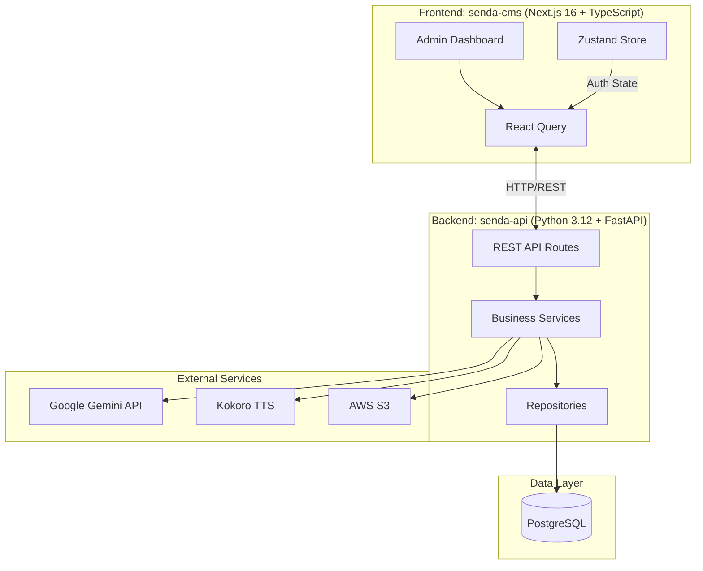

<div align="center">


# Senda

**AI-Powered Meditation Course Platform**

[](./senda-api/version.py)
[](./LICENSE)
[](./senda-api/pyproject.toml)
[](./senda-cms/package.json)
[](./docker-compose.yml)

A complete platform for creating and managing guided meditation courses using artificial intelligence. Generate meditation scripts with **Google Gemini** and convert them to high-quality audio using **Kokoro TTS**.

[Documentation](#documentation) • [Quick Start](#quick-start) • [Architecture](#architecture) • [Deployment](#deployment)

</div>

## Repository Structure

Senda is a **multirepo project** with three separate Git repositories coordinated through a central orchestrator:

```
senda/                          # Orchestrator Repository
├── senda-api/                  # Backend service (independent repo)
│   └── README.md              # API Documentation
├── senda-cms/                  # Frontend service (independent repo)
│   └── README.md              # CMS Documentation
├── docker-compose.yml          # Full stack orchestration
├── Makefile                    # Development commands
└── docs/                       # Shared documentation
```

**Repository Details:**
- **senda** (orchestrator): Coordinates deployment and local development
- **[senda-api](https://github.com/fariassdev/senda-api)** (independent): FastAPI backend — FastAPI backend for course management & AI integration
- **[senda-cms](https://github.com/fariassdev/senda-cms)** (independent): Next.js frontend — Next.js admin dashboard for content creation

## Key Features

- **Course Management** — Create and organize meditation courses with multiple lessons
- **AI Script Generation** — Automatically generate meditation scripts using Google Gemini  
- **Text-to-Speech** — Convert scripts to audio via Kokoro TTS with customizable voices
- **Batch Processing** — Generate scripts and audio for entire courses at once
- **Admin Authentication** — Secure JWT-based admin-only access
- **Cloud Ready** — Deploy to Google Cloud Run (API) and Vercel (CMS)

## Architecture



## Quick Start

### Prerequisites

- [Docker](https://www.docker.com/) and Docker Compose  
- NVIDIA GPU with CUDA drivers (required for Kokoro TTS)
- Git

### One-Command Setup

**Repository Setup:** This project contains three Git repositories coordinated together:
- `senda-api/` — Backend API (FastAPI + Python)
- `senda-cms/` — Frontend CMS (Next.js + TypeScript)

```bash
# Clone the orchestrator repository
git clone https://github.com/fariassdev/senda.git
cd senda

# Clone the service repositories
git clone https://github.com/fariassdev/senda-api.git
git clone https://github.com/fariassdev/senda-cms.git

# Configure environment files
cp senda-api/.env.example senda-api/.env
cp senda-cms/.env.local.example senda-cms/.env

# Full stack setup: build, initialize DB, migrate, and start services
make setup
```

### Access the Services

| Service | URL | Purpose |
|---------|-----|---------|
| **CMS** | http://localhost:3000 | Admin dashboard for course management |
| **API** | http://localhost:8081 | REST API backend |
| **API Docs** | http://localhost:8081/api/docs | Interactive Swagger documentation |
| **Database** | localhost:5439 | PostgreSQL |
| **TTS Service** | http://localhost:8880 | Text-to-speech engine |

## Project Structure

```
senda/                          # Orchestrator root
├── senda-api/                  # Backend (Python FastAPI)
│   ├── senda/
│   │   ├── api/               # Routes, schemas, middlewares
│   │   ├── core/              # Config, enums, dependencies
│   │   ├── domain/            # DTOs, repository interfaces
│   │   ├── infrastructure/    # Models, repositories, providers
│   │   └── services/          # Business logic
│   ├── tests/                 # API and unit tests
│   └── terraform/             # GCP infrastructure
│
├── senda-cms/                  # Frontend (Next.js TypeScript)
│   ├── src/
│   │   ├── app/               # App Router pages
│   │   ├── components/        # Reusable UI components
│   │   ├── containers/        # Feature containers with logic
│   │   └── hooks/             # React Query hooks
│   └── public/                # Static assets
│
├── docker-compose.yml          # Full stack orchestration
├── Makefile                    # Development commands
└── docs/                       # Architecture & diagrams
```

## Development Commands

All commands are executed from the project root using `make`:

### Essential Commands

```bash
make setup        # Full setup (build + db init + migrate)
make up           # Start all services
make down         # Stop all services
make logs         # View all logs
make status       # Check service status
```

### Database Management

```bash
make db-init      # Initialize databases
make db-seed      # Seed with sample data
make db-shell     # Connect to PostgreSQL shell
make migrate      # Run migrations
```

### Service-Specific Commands

```bash
make logs-api     # View API logs
make logs-cms     # View CMS logs
make restart-api  # Restart API service
make restart-cms  # Restart CMS service
make shell-api    # Access API container shell
make shell-cms    # Access CMS container shell
make help         # Show all available commands
```

## Configuration

### Environment Variables

Each service requires its own configuration file.

**API** (`senda-api/.env`)

| Variable | Description | Required |
|----------|-------------|----------|
| `DATABASE_URL` | PostgreSQL connection string | ✓ |
| `JWT_SECRET` | Secret key for JWT token signing | ✓ |
| `GEMINI_API_KEY` | Google Gemini API key | ✓ |
| `KOKORO_API_URL` | Kokoro TTS service URL | ✓ |
| `AWS_ACCESS_KEY_ID` | AWS S3 credentials | ✓ |
| `AWS_SECRET_ACCESS_KEY` | AWS S3 credentials | ✓ |
| `S3_BUCKET_NAME` | S3 bucket for audio files | ✓ |

**CMS** (`senda-cms/.env`)

| Variable | Description | Required |
|----------|-------------|----------|
| `NEXT_PUBLIC_API_BASE_URL` | Backend API endpoint | ✓ |
| `NEXT_PUBLIC_BUILD` | Environment identifier | ✓ |
| `JWT_SECRET` | Must match backend secret | ✓ |

## Deployment

### Production Architecture

| Component | Platform | Purpose |
|-----------|----------|---------|
| **API** | Google Cloud Run | Auto-scaling containerized backend |
| **CMS** | Vercel | Edge-deployed frontend |
| **Database** | Neon | Serverless PostgreSQL |
| **TTS** | Oracle Cloud | Self-hosted Kokoro service |

### CI/CD Pipeline

GitHub Actions automates deployments based on branch:

- **`main` branch** → Production deployment (requires approval)
- **`develop` branch** → Staging deployment (automatic)
- **Pull Requests** → Preview deployments on Vercel

## 📚 Documentation

Comprehensive documentation is available:

### Core Documentation
- [Project Overview](./docs/project-overview.md) — High-level system overview
- [Integration Architecture](./docs/integration-architecture.md) — Service integration patterns
- [Data Models](./docs/data-models.md) — Database schema documentation

### Architecture & Development
- [API Architecture](./docs/architecture-senda-api.md) — Backend design details
- [CMS Architecture](./docs/architecture-senda-cms.md) — Frontend design details
- [API Development Guide](./docs/development-guide-senda-api.md) — Backend workflow
- [CMS Development Guide](./docs/development-guide-senda-cms.md) — Frontend workflow

### Quick Start
- [API README](https://github.com/fariassdev/senda-api) — Backend getting started
- [CMS README](https://github.com/fariassdev/senda-cms) — Frontend getting started

## 🧪 Testing

```bash
# API
cd senda-api && make test              # Run tests
cd senda-api && make test-cov          # With coverage

# CMS
cd senda-cms && bun typecheck          # Type checking
cd senda-cms && bun lint               # Linting
cd senda-cms && bun test:run           # Run tests
```

## 🔐 Security

- JWT-based authentication with token refresh
- Admin-only access control
- HTTPS enforcement in production
- Environment variables for sensitive data
- CORS protection configured per environment

## Contributing

Contributions welcome! Please open issues or pull requests.

## License

AGPL-3.0 License — see [LICENSE](./LICENSE) for details

---
