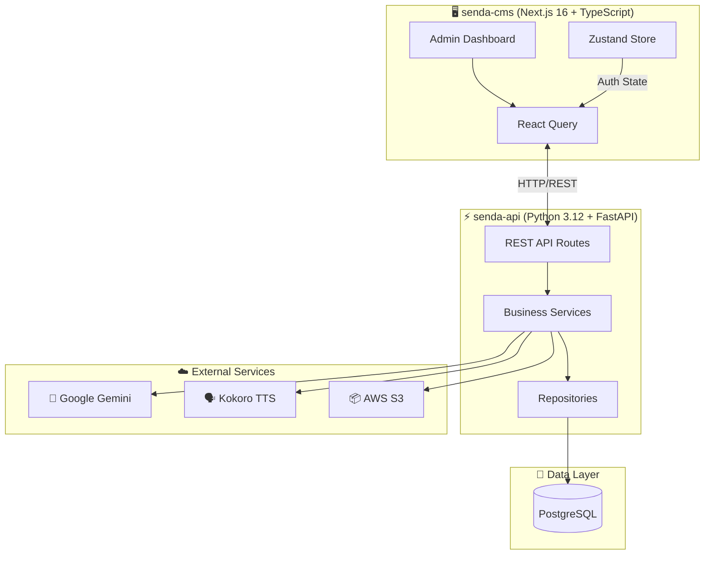

# Senda 🧘‍♀️

> AI-Powered Meditation Course Platform

Senda is a complete platform for creating and managing guided meditation courses using artificial intelligence. Generate meditation scripts with Google Gemini and convert them to high-quality audio using Kokoro TTS.

## ✨ Features

- **🎯 Course Management** - Create and organize meditation courses with multiple lessons
- **🤖 AI Script Generation** - Automatically generate meditation scripts using Google Gemini
- **🗣️ Text-to-Speech** - Convert scripts to audio via Kokoro TTS with customizable voices
- **📦 Batch Processing** - Generate scripts and audio for entire courses at once
- **🔐 Admin Authentication** - Secure JWT-based admin-only access
- **☁️ Cloud Ready** - Deploy to Google Cloud Run (API) and Vercel (CMS)

## 🏗️ Architecture



## 🚀 Quick Start

### Prerequisites

- [Docker](https://www.docker.com/) and Docker Compose
- NVIDIA GPU with drivers (required for Kokoro TTS)

### One-Command Setup

```bash
# Clone the main repository
git clone https://github.com/fariassdev/senda.git
cd senda

# Clone the senda-api repository
git clone https://github.com/fariassdev/senda-api.git

# Clone the senda-cms repository
git clone https://github.com/fariassdev/senda-cms.git

# Configure environment files
cp senda-api/.env.example senda-api/.env
cp senda-cms/.env.local.example senda-cms/.env

# Full stack setup: build, initialize DB, run migrations and start services
make setup
```

### Access the Services

| Service    | URL                     | Description              |
| ---------- | ----------------------- | ------------------------ |
| CMS        | http://localhost:3000   | Admin Dashboard          |
| API        | http://localhost:8081   | REST API                 |
| API Docs   | http://localhost:8081/api/docs | Swagger Documentation |
| PostgreSQL | localhost:5439          | Database                 |
| Kokoro TTS | http://localhost:8880   | Text-to-Speech Service   |

## 📦 Project Structure

```
senda/
├── senda-api/              # Backend (Python FastAPI)
│   ├── senda/              # Application source code
│   │   ├── api/            # Routes, schemas, middlewares
│   │   ├── core/           # Config, enums, dependencies
│   │   ├── domain/         # DTOs, repository interfaces
│   │   ├── infrastructure/ # Models, repositories, providers
│   │   └── services/       # Business logic
│   ├── tests/              # API and unit tests
│   └── terraform/          # GCP infrastructure as code
│
├── senda-cms/              # Frontend (Next.js TypeScript)
│   ├── src/
│   │   ├── app/            # Next.js App Router pages
│   │   ├── components/     # Reusable UI components
│   │   ├── containers/     # Feature-specific containers
│   │   └── hooks/          # API hooks (React Query)
│   └── docs/               # CMS documentation
│
├── docker-compose.yml      # Full stack orchestration
├── Makefile                # Development commands
└── docs/                   # Project-level diagrams
```

## 🛠️ Development Commands

All commands are executed from the project root using `make`:

### Essential Commands

```bash
make setup        # Full setup (build + db init + migrate)
make up           # Start all services
make down         # Stop all services
make logs         # View all logs
make status       # Check service status
```

### Database Commands

```bash
make db-init      # Initialize databases
make db-seed      # Seed with sample data
make db-shell     # Connect to PostgreSQL shell
make migrate      # Run migrations
```

### Individual Services

```bash
make logs-api     # View API logs only
make logs-cms     # View CMS logs only
make restart-api  # Restart API service
make restart-cms  # Restart CMS service
make shell-api    # Shell into API container
make shell-cms    # Shell into CMS container
```

### Full Command Reference

```bash
make help         # Show all available commands
```

## 🔧 Configuration

### Environment Variables

Each service requires its own environment file:

**API** (`senda-api/.env`):

| Variable          | Description                         |
| ----------------- | ----------------------------------- |
| `DATABASE_URL`    | PostgreSQL connection string        |
| `JWT_SECRET`      | Secret key for JWT tokens           |
| `GEMINI_API_KEY`  | Google Gemini API key               |
| `KOKORO_API_URL`  | Kokoro TTS service URL              |
| `AWS_ACCESS_KEY`  | AWS credentials for S3              |
| `AWS_SECRET_KEY`  | AWS credentials for S3              |
| `S3_BUCKET_NAME`  | S3 bucket for audio storage         |

**CMS** (`senda-cms/.env`):

| Variable                   | Description                    |
| -------------------------- | ------------------------------ |
| `NEXT_PUBLIC_API_BASE_URL` | Backend API URL                |
| `NEXT_PUBLIC_BUILD`        | Environment identifier         |
| `JWT_SECRET`               | JWT secret (must match API)    |

## 🚢 Deployment

### Production Architecture

- **API**: Google Cloud Run (auto-scaling containers)
- **CMS**: Vercel (edge deployment)
- **Database**: Neon serveless DB for PostgreSQL
- **TTS**: Self-hosted Kokoro (Oracle Cloud)

### CI/CD Pipeline

The project uses GitHub Actions for automated deployments:

- **Production** (`main` branch) → Deploys to production after approval
- **Staging** (`develop` branch) → Automatic deployment to staging
- **Preview** (Pull Requests) → Preview deployments on Vercel

For detailed deployment instructions, see:
- [API Deployment Guide](./senda-api/DEPLOYMENT.md)
- [Deployment Guide](./docs/deployment-guide.md)

## 📚 Documentation

### Project Documentation

Comprehensive documentation is available in `docs/`:

- [Documentation Index](./docs/index.md) - Complete documentation index
- [Project Overview](./docs/project-overview.md) - High-level system overview
- [Integration Architecture](./docs/integration-architecture.md) - Service integration patterns
- [Data Models](./docs/data-models.md) - Database schema documentation

### Architecture Documentation

- [API Architecture](./docs/architecture-senda-api.md) - Backend architecture details
- [CMS Architecture](./docs/architecture-senda-cms.md) - Frontend architecture details
- [Hexagonal Architecture](./docs/hexagonal-architecture-api.md) - Clean architecture patterns

### Development Guides

- [API Development Guide](./docs/development-guide-senda-api.md) - Backend development workflow
- [CMS Development Guide](./docs/development-guide-senda-cms.md) - Frontend development workflow
- [API README](./senda-api/README.md) - Backend getting started
- [CMS README](./senda-cms/README.md) - Frontend getting started

## 🧪 Testing

### API Tests

```bash
cd senda-api
make test         # Run all tests
make test-cov     # Run tests with coverage report
```

### CMS Checks

```bash
cd senda-cms
bun typecheck     # TypeScript type checking
bun lint          # ESLint code quality
bun test:run      # Run tests
```

## 🔐 Security

- JWT-based authentication with token refresh
- Admin-only access control
- HTTPS enforcement in production
- Environment variables for sensitive data
- CORS protection configured per environment

## 🤝 Contributing

1. Fork the repository
2. Create a feature branch: `git checkout -b feature/amazing-feature`
3. Commit changes: `git commit -m 'feat: add amazing feature'`
4. Push to branch: `git push origin feature/amazing-feature`
5. Open a Pull Request

### Code Quality Standards

- Follow conventional commit messages
- Ensure all tests pass
- Run linting before committing
- Use TypeScript for frontend type safety
- Follow Python type hints for backend

## 📄 License

This project is private and proprietary. All rights reserved.

---
