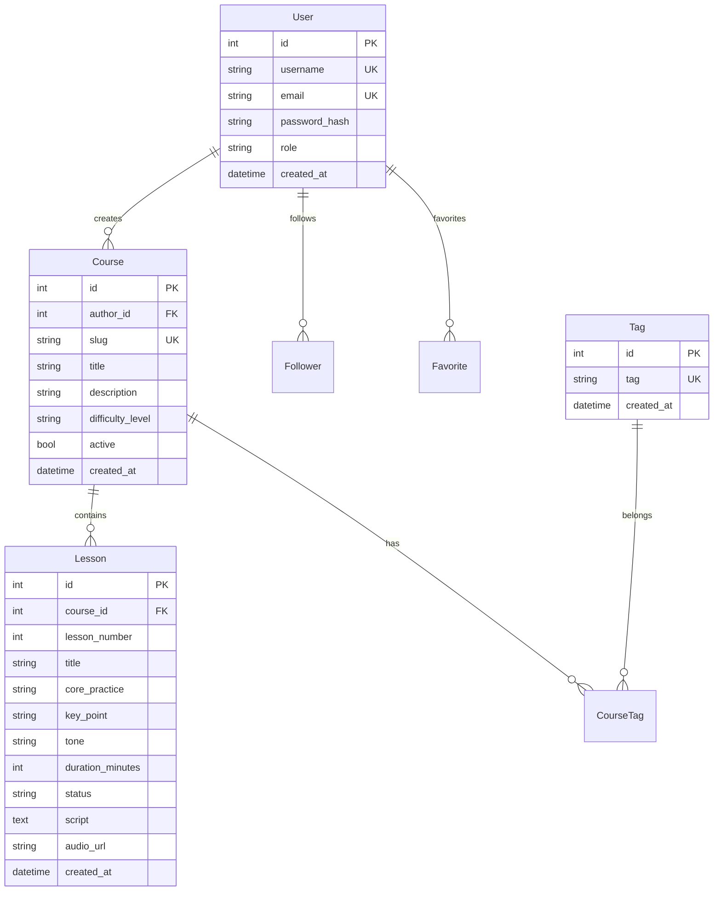

# Architecture - Senda API

**Part:** senda-api
**Type:** Backend
**Stack:** Python 3.12 + FastAPI + SQLAlchemy 2.0

---

## Architecture Pattern

**Clean Architecture** with strict layer separation:

```
┌─────────────────────────────────────────────────────────┐
│                    API Layer (api/)                      │
│     Routes, Schemas, Middlewares, Dependencies          │
├─────────────────────────────────────────────────────────┤
│                 Services Layer (services/)               │
│        Business Logic, Orchestration, AI Integration    │
├─────────────────────────────────────────────────────────┤
│                  Domain Layer (domain/)                  │
│   DTOs, Repository Interfaces, Service Interfaces       │
├─────────────────────────────────────────────────────────┤
│             Infrastructure Layer (infrastructure/)       │
│  Models, Repositories, Providers, Mappers, Migrations   │
├─────────────────────────────────────────────────────────┤
│                   Core Layer (core/)                     │
│              Config, Enums, Dependencies                 │
└─────────────────────────────────────────────────────────┘
```

---

## Directory Structure

```
senda-api/
├── senda/
│   ├── __init__.py
│   ├── app.py                    # FastAPI application factory
│   │
│   ├── api/                      # API Layer
│   │   ├── middlewares.py        # CORS, logging, auth middleware
│   │   ├── router.py             # Main router aggregation
│   │   ├── routes/               # Route handlers by domain
│   │   │   ├── authentication.py # Login, register
│   │   │   ├── course.py         # Course CRUD + generation
│   │   │   ├── lesson.py         # Lesson CRUD + generation
│   │   │   ├── profile.py        # User profiles
│   │   │   ├── users.py          # User management
│   │   │   ├── tag.py            # Tags
│   │   │   └── health_check.py   # Health endpoint
│   │   └── schemas/              # Pydantic request/response schemas
│   │       ├── user.py
│   │       ├── course.py
│   │       ├── lesson.py
│   │       └── ...
│   │
│   ├── services/                 # Application/Business Layer
│   │   ├── auth.py               # Authentication logic
│   │   ├── auth_token.py         # JWT token handling
│   │   ├── course.py             # Course business logic
│   │   ├── lesson.py             # Lesson business logic
│   │   ├── script_generation.py  # AI script generation
│   │   ├── audio_generation.py   # TTS audio generation
│   │   ├── profile.py            # Profile logic
│   │   ├── user.py               # User logic
│   │   ├── password.py           # Password hashing
│   │   └── tag.py                # Tag logic
│   │
│   ├── domain/                   # Domain Layer
│   │   ├── dtos/                 # Data Transfer Objects
│   │   │   ├── user.py
│   │   │   ├── course.py
│   │   │   ├── lesson.py
│   │   │   └── ...
│   │   ├── repositories/         # Repository interfaces (protocols)
│   │   │   ├── user.py
│   │   │   ├── course.py
│   │   │   ├── lesson.py
│   │   │   └── ...
│   │   ├── services/             # Service interfaces
│   │   ├── exceptions/           # Domain exceptions
│   │   └── utils/                # Domain utilities
│   │
│   ├── infrastructure/           # Infrastructure Layer
│   │   ├── models.py             # SQLAlchemy models
│   │   ├── repositories/         # Repository implementations
│   │   │   ├── user.py
│   │   │   ├── course.py
│   │   │   ├── lesson.py
│   │   │   └── ...
│   │   ├── mappers/              # DTO ↔ Model mappers
│   │   ├── providers/            # External service clients
│   │   │   ├── gemini.py         # Google Gemini client
│   │   │   ├── kokoro.py         # Kokoro TTS client
│   │   │   └── s3.py             # AWS S3 client
│   │   ├── prompts/              # AI prompt templates
│   │   ├── loaders/              # Custom loaders
│   │   ├── config/               # Database config
│   │   ├── alembic/              # Database migrations
│   │   │   ├── alembic.ini
│   │   │   ├── env.py
│   │   │   └── versions/         # Migration files
│   │   └── utils/                # Infrastructure utilities
│   │
│   └── core/                     # Core/Shared Layer
│       ├── config.py             # Settings (pydantic-settings)
│       ├── enums.py              # Enumerations
│       └── dependencies.py       # FastAPI dependencies
│
├── tests/                        # Test suite
│   ├── conftest.py               # Pytest fixtures
│   ├── utils.py                  # Test utilities
│   ├── api/                      # API integration tests
│   ├── unit/                     # Unit tests
│   └── core/                     # Core tests
│
├── scripts/                      # Utility scripts
│   ├── run-migrations.sh         # Migration runner for Cloud Run Jobs
│   ├── setup-gcp.sh              # GCP setup script
│   └── setup-gcp.ps1             # PowerShell version
│
├── terraform/                    # Infrastructure as Code
│   ├── main.tf
│   ├── variables.tf
│   ├── outputs.tf
│   └── terraform.tfvars.example
│
├── Dockerfile                    # Container definition
├── Makefile                      # Development commands
├── pyproject.toml                # Project configuration
└── .env.example                  # Environment template
```

---

## Data Models

### Entity Relationship Diagram



### Lesson Status Enum

```python
class LessonStatus(str, Enum):
    PENDING = "PENDING"
    SCRIPT_GENERATING = "SCRIPT_GENERATING"
    SCRIPT_READY = "SCRIPT_READY"
    SCRIPT_FAILED = "SCRIPT_FAILED"
    AUDIO_GENERATING = "AUDIO_GENERATING"
    AUDIO_READY = "AUDIO_READY"
    AUDIO_FAILED = "AUDIO_FAILED"
```

---

## Key Services

### Script Generation Service

**Location:** `senda/services/script_generation.py`

**Responsibilities:**
- Build AI prompts from lesson metadata
- Call Google Gemini API
- Parse and validate generated scripts
- Handle generation failures with status updates

**Key Methods:**
- `generate_lesson_script(lesson: LessonDTO) -> str`
- `generate_course_scripts(course_id: int) -> None`

### Audio Generation Service

**Location:** `senda/services/audio_generation.py`

**Responsibilities:**
- Convert scripts to speech using Kokoro TTS
- Combine audio segments with pydub
- Upload to AWS S3
- Handle parallel audio generation

**Key Methods:**
- `generate_lesson_audio(lesson: LessonDTO, voice: str, speed: float) -> str`
- `generate_course_audio(course_id: int, config: AudioConfig) -> None`

### Course Service

**Location:** `senda/services/course.py`

**Responsibilities:**
- Course CRUD operations
- Tag management
- Activation workflow
- Coordinate script/audio generation

---

## API Routes Overview

| Route | Methods | Description |
|-------|---------|-------------|
| `/api/health-check` | GET | Health check endpoint |
| `/api/users/login` | POST | User login |
| `/api/users` | POST | User registration |
| `/api/user` | GET, PUT | Current user operations |
| `/api/profiles/{username}` | GET | User profiles |
| `/api/tags` | GET | List tags |
| `/api/courses` | GET, POST | Course list/create |
| `/api/courses/{slug}` | GET, PUT, DELETE | Course operations |
| `/api/courses/{slug}/lessons` | GET, POST | Lesson list/create |
| `/api/courses/{slug}/lessons/{num}` | GET, PUT, DELETE | Lesson operations |
| `/api/courses/{slug}/lessons/reorder` | PUT | Reorder lessons |
| `/api/courses/{slug}/generate-scripts` | POST | Batch script generation |
| `/api/courses/{slug}/generate-audio` | POST | Batch audio generation |
| `/api/courses/{slug}/lessons/{num}/generate-script` | POST | Single script generation |
| `/api/courses/{slug}/lessons/{num}/generate-audio` | POST | Single audio generation |

---

## Authentication

### JWT Configuration

```python
# core/config.py
class Settings:
    JWT_SECRET_KEY: str
    JWT_ALGORITHM: str = "HS256"
    ACCESS_TOKEN_EXPIRE_MINUTES: int = 60
```

### Auth Middleware

```python
# api/middlewares.py
- Extracts token from Authorization header
- Validates JWT signature
- Loads user from database
- Sets current_user in request state
```

### Protected Routes

All routes except `/users/login`, `/users` (register), and `/health-check` require authentication.

---

## External Integrations

### Google Gemini

**Provider:** `infrastructure/providers/gemini.py`

```python
class GeminiProvider:
    async def generate_content(self, prompt: str) -> str
```

**Configuration:**
- `GEMINI_API_KEY` environment variable
- Model: `gemini-pro` or user-configured

### Kokoro TTS

**Provider:** `infrastructure/providers/kokoro.py`

```python
class KokoroProvider:
    async def text_to_speech(self, text: str, voice: str, speed: float) -> bytes
```

**Configuration:**
- `KOKORO_API_URL` environment variable (default: `http://localhost:8880/v1/audio/speech`)
- Voices and speed configurable per request

### AWS S3

**Provider:** `infrastructure/providers/s3.py`

```python
class S3Provider:
    async def upload_file(self, file: bytes, key: str) -> str
    async def get_presigned_url(self, key: str) -> str
```

**Configuration:**
- `AWS_ACCESS_KEY_ID`
- `AWS_SECRET_ACCESS_KEY`
- `AWS_BUCKET_NAME`
- `AWS_REGION`

---

## Development Commands

```bash
# Start development server
make run

# Run tests
make test

# Run linting
make lint

# Auto-fix linting
make fix

# Run type checking
make typecheck

# Database migrations
make migrate              # Apply migrations
make migration message="x" # Create migration
make migrate-down         # Rollback one
```

---

## Deployment

### Docker Build

```dockerfile
FROM python:3.12-slim
# Install uv, dependencies, copy code
# Entrypoint: uvicorn senda.app:app --host 0.0.0.0 --port 8000
```

### Cloud Run Configuration

- **Staging:** 1 CPU, 512Mi memory, 0-10 instances
- **Production:** 2 CPU, 1Gi memory, 1-100 instances
- **Migrations:** Cloud Run Jobs before deployment

### CI/CD

- **develop branch** → Staging (auto-deploy)
- **main branch** → Production (manual approval)
