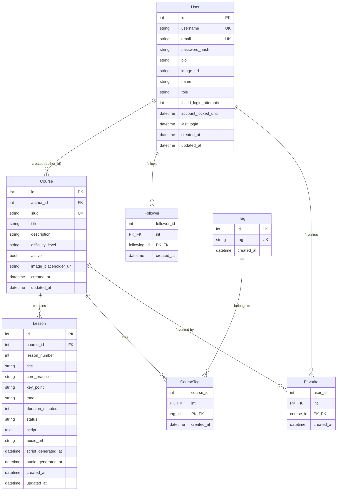
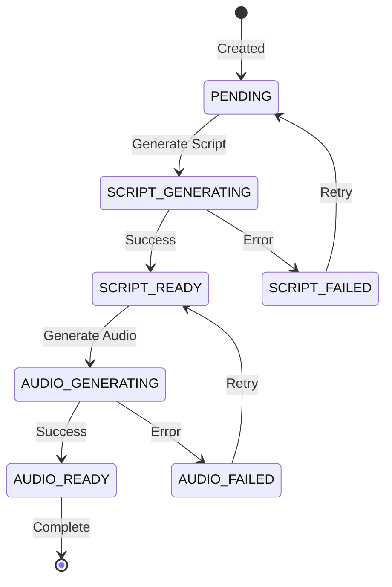

# Data Models

**Project:** Senda
**Database:** PostgreSQL 18
**ORM:** SQLAlchemy 2.0

---

## Entity Overview

| Entity | Table | Description |
|--------|-------|-------------|
| User | `user` | Admin users with authentication |
| Course | `course` | Meditation courses |
| Lesson | `lesson` | Individual lessons within courses |
| Tag | `tag` | Categorization tags |
| CourseTag | `course_tag` | Many-to-many course-tag relationship |
| Follower | `follower` | User follows relationship |
| Favorite | `favorite` | User favorites courses |

---

## Entity Relationship Diagram



---

## Model Definitions

### User

```python
class User(Base):
    __tablename__ = "user"
    
    id: Mapped[int] = mapped_column(primary_key=True, autoincrement=True)
    username: Mapped[str] = mapped_column(unique=True)
    email: Mapped[str] = mapped_column(unique=True)
    password_hash: Mapped[str]
    bio: Mapped[str] = mapped_column(nullable=True)
    image_url: Mapped[str] = mapped_column(nullable=True)
    name: Mapped[str] = mapped_column(nullable=True)
    role: Mapped[str] = mapped_column(default=UserRole.USER)
    
    # Security fields
    failed_login_attempts: Mapped[int] = mapped_column(default=0)
    account_locked_until: Mapped[datetime] = mapped_column(nullable=True)
    last_login: Mapped[datetime] = mapped_column(nullable=True)
    
    created_at: Mapped[datetime]
    updated_at: Mapped[datetime] = mapped_column(nullable=True)
```

**Indexes:**
- `username` (unique)
- `email` (unique)

**Relationships:**
- One-to-many with `Course` (author)
- Many-to-many with `User` (followers)
- Many-to-many with `Course` (favorites)

### Course

```python
class Course(Base):
    __tablename__ = "course"
    
    id: Mapped[int] = mapped_column(primary_key=True, autoincrement=True)
    author_id: Mapped[int] = mapped_column(ForeignKey("user.id"), nullable=False)
    slug: Mapped[str] = mapped_column(nullable=False, unique=True)
    title: Mapped[str]
    description: Mapped[str]
    difficulty_level: Mapped[str] = mapped_column(default="BEGINNER")
    active: Mapped[bool] = mapped_column(default=False)
    image_placeholder_url: Mapped[str] = mapped_column(nullable=True)
    
    created_at: Mapped[datetime]
    updated_at: Mapped[datetime] = mapped_column(nullable=True)
```

**Indexes:**
- `slug` (unique)
- `author_id` (foreign key)

**Relationships:**
- Many-to-one with `User` (author)
- One-to-many with `Lesson`
- Many-to-many with `Tag`

**Cascade Deletes:**
- Lessons are deleted when course is deleted
- CourseTag entries are deleted when course is deleted
- Favorites are deleted when course is deleted

### Lesson

```python
class Lesson(Base):
    __tablename__ = "lesson"
    
    id: Mapped[int] = mapped_column(primary_key=True, autoincrement=True)
    course_id: Mapped[int] = mapped_column(
        ForeignKey("course.id", ondelete="CASCADE"), nullable=False
    )
    
    # Ordering
    lesson_number: Mapped[int]
    
    # Content
    title: Mapped[str]
    core_practice: Mapped[str]
    key_point: Mapped[str]
    tone: Mapped[str]
    duration_minutes: Mapped[int]
    
    # Generation workflow
    status: Mapped[str] = mapped_column(default=LessonStatus.PENDING.value)
    
    # Generated content (nullable until generated)
    script: Mapped[str] = mapped_column(nullable=True)  # JSON stored as text
    audio_url: Mapped[str] = mapped_column(nullable=True)
    script_generated_at: Mapped[datetime] = mapped_column(nullable=True)
    audio_generated_at: Mapped[datetime] = mapped_column(nullable=True)
    
    created_at: Mapped[datetime]
    updated_at: Mapped[datetime] = mapped_column(nullable=True)
```

**Indexes:**
- `course_id` (foreign key)
- `(course_id, lesson_number)` composite for ordering

**Relationships:**
- Many-to-one with `Course`

### Tag

```python
class Tag(Base):
    __tablename__ = "tag"
    
    id: Mapped[int] = mapped_column(primary_key=True, autoincrement=True)
    tag: Mapped[str] = mapped_column(nullable=False, unique=True)
    created_at: Mapped[datetime]
```

**Indexes:**
- `tag` (unique)

### CourseTag (Junction Table)

```python
class CourseTag(Base):
    __tablename__ = "course_tag"
    
    course_id: Mapped[int] = mapped_column(
        ForeignKey("course.id", ondelete="CASCADE"), primary_key=True
    )
    tag_id: Mapped[int] = mapped_column(ForeignKey("tag.id"), primary_key=True)
    created_at: Mapped[datetime]
```

### Follower (Junction Table)

```python
class Follower(Base):
    __tablename__ = "follower"
    
    follower_id: Mapped[int] = mapped_column(ForeignKey("user.id"), primary_key=True)
    following_id: Mapped[int] = mapped_column(ForeignKey("user.id"), primary_key=True)
    created_at: Mapped[datetime]
```

### Favorite (Junction Table)

```python
class Favorite(Base):
    __tablename__ = "favorite"
    
    user_id: Mapped[int] = mapped_column(ForeignKey("user.id"), primary_key=True)
    course_id: Mapped[int] = mapped_column(
        ForeignKey("course.id", ondelete="CASCADE"), primary_key=True
    )
    created_at: Mapped[datetime]
```

---

## Enumerations

### LessonStatus

```python
class LessonStatus(str, Enum):
    PENDING = "PENDING"
    SCRIPT_GENERATING = "SCRIPT_GENERATING"
    SCRIPT_READY = "SCRIPT_READY"
    SCRIPT_FAILED = "SCRIPT_FAILED"
    AUDIO_GENERATING = "AUDIO_GENERATING"
    AUDIO_READY = "AUDIO_READY"
    AUDIO_FAILED = "AUDIO_FAILED"
```

### UserRole

```python
class UserRole(str, Enum):
    USER = "USER"
    ADMIN = "ADMIN"
```

### DifficultyLevel

```python
class DifficultyLevel(str, Enum):
    BEGINNER = "BEGINNER"
    INTERMEDIATE = "INTERMEDIATE"
    ADVANCED = "ADVANCED"
```

---

## Lesson Status State Machine



---

## Migrations

**Location:** `senda-api/senda/infrastructure/alembic/versions/`

| Migration | Description |
|-----------|-------------|
| `666cc53a93be_add_tables.py` | Initial schema creation |
| `549c7390883c_add_cascade_delete...` | Add cascade delete to course FKs |

### Running Migrations

```bash
# Apply all pending migrations
cd senda-api
make migrate

# Create new migration
make migration message="add_new_field"

# Auto-generate from model changes
make migration-auto message="add_new_field"

# Rollback one migration
make migrate-down

# View migration history
make migrate-history
```

---

## DTOs (Data Transfer Objects)

DTOs are defined in `senda/domain/dtos/` and used for data exchange between layers.

### UserDTO

```python
@dataclass
class UserDTO:
    id: int
    username: str
    email: str
    bio: str | None
    image_url: str | None
    name: str | None
    role: str
    created_at: datetime
```

### CourseDTO

```python
@dataclass
class CourseDTO:
    id: int
    author_id: int
    slug: str
    title: str
    description: str
    difficulty_level: str
    active: bool
    image_placeholder_url: str | None
    created_at: datetime
    updated_at: datetime | None
    lessons: list[LessonDTO] = field(default_factory=list)
    tags: list[str] = field(default_factory=list)
```

### LessonDTO

```python
@dataclass
class LessonDTO:
    id: int
    course_id: int
    lesson_number: int
    title: str
    core_practice: str
    key_point: str
    tone: str
    duration_minutes: int
    status: str
    script: str | None
    audio_url: str | None
    script_generated_at: datetime | None
    audio_generated_at: datetime | None
    created_at: datetime
    updated_at: datetime | None
```

---

## API Schemas (Pydantic)

### Course Schemas

```python
class CourseCreate(BaseModel):
    title: str
    description: str
    difficulty_level: str = "BEGINNER"
    tag_list: list[str] = []

class CourseUpdate(BaseModel):
    title: str | None = None
    description: str | None = None
    difficulty_level: str | None = None
    active: bool | None = None
    tag_list: list[str] | None = None

class CourseResponse(BaseModel):
    slug: str
    title: str
    description: str
    difficulty_level: str
    active: bool
    created_at: datetime
    updated_at: datetime | None
    lessons: list[LessonResponse] = []
    tags: list[str] = []
    author: UserProfileResponse
```

### Lesson Schemas

```python
class LessonCreate(BaseModel):
    title: str
    core_practice: str
    key_point: str
    tone: str
    duration_minutes: int

class LessonUpdate(BaseModel):
    title: str | None = None
    core_practice: str | None = None
    key_point: str | None = None
    tone: str | None = None
    duration_minutes: int | None = None
    script: str | None = None

class LessonResponse(BaseModel):
    lesson_number: int
    title: str
    core_practice: str
    key_point: str
    tone: str
    duration_minutes: int
    status: str
    script: str | None
    audio_url: str | None
    created_at: datetime
```
