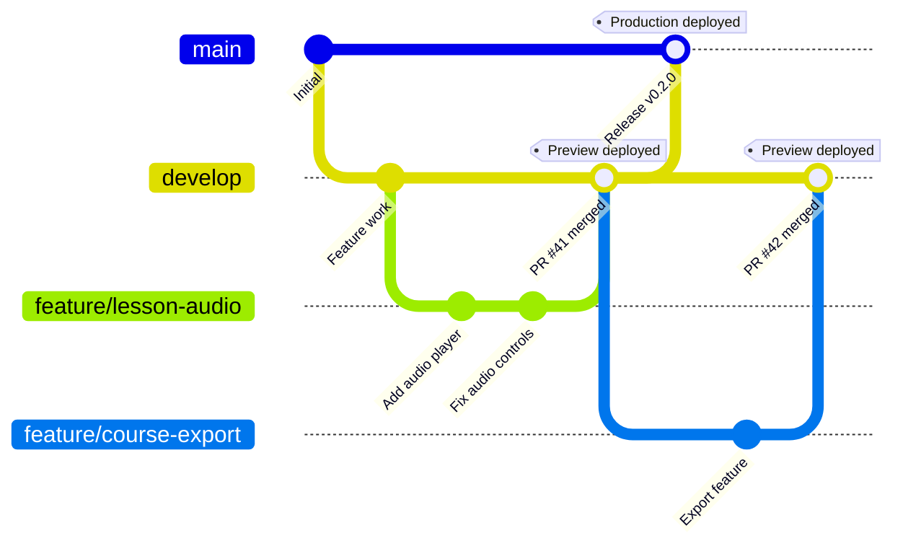

# Deployment Guide

**Project:** Senda
**API Hosting:** Google Cloud Run
**CMS Hosting:** Vercel

---

## Architecture Overview

```
┌─────────────────────────────────────────────────────────────────┐
│                         GitHub                                   │
│  ┌──────────────┐                    ┌──────────────┐           │
│  │   develop    │ ───────────────────│     main     │           │
│  └──────────────┘                    └──────────────┘           │
│         │                                   │                    │
│         ▼                                   ▼                    │
│  ┌──────────────┐                    ┌──────────────┐           │
│  │   Staging    │                    │  Production  │           │
│  │   (Auto)     │                    │  (Approval)  │           │
│  └──────────────┘                    └──────────────┘           │
└───────────┬─────────────────────────────────┬───────────────────┘
            │                                 │
            ▼                                 ▼
┌───────────────────────┐       ┌───────────────────────┐
│   Google Cloud Run    │       │   Google Cloud Run    │
│   senda-api-staging   │       │   senda-api-prod      │
└───────────────────────┘       └───────────────────────┘

┌───────────────────────────────────────────────────────────────┐
│                         Vercel                                 │
│  ┌─────────────────┐              ┌─────────────────┐         │
│  │ Preview (PRs)   │              │ Production      │         │
│  │ → Staging API   │              │ → Production API│         │
│  └─────────────────┘              └─────────────────┘         │
└───────────────────────────────────────────────────────────────┘
```

---

## API Deployment (Cloud Run)

### Prerequisites

1. Google Cloud account with billing
2. `gcloud` CLI installed and authenticated
3. Terraform >= 1.0
4. Docker installed

### Initial Setup

```bash
cd senda-api

# Run GCP setup script
./scripts/setup-gcp.sh <PROJECT_ID> <GITHUB_ORG> <GITHUB_REPO>

# Example:
./scripts/setup-gcp.sh my-senda-project fariassdev senda
```

This creates:
- Artifact Registry for Docker images
- Cloud Run services (staging + production)
- Workload Identity Federation for GitHub Actions
- Service accounts with minimal permissions

### GitHub Secrets

Add to repository settings:

| Secret | Value |
|--------|-------|
| `GCP_PROJECT_ID` | Your GCP project ID |
| `WIF_PROVIDER` | Workload Identity Provider path |
| `WIF_SERVICE_ACCOUNT` | Service account email |

### GitHub Environments

Create two environments:

**Staging:**
- No protection rules
- Auto-deploys on `develop` push

**Production:**
- Required reviewers
- Deploys on `main` push with approval

### Terraform Deployment

```bash
cd terraform

# Configure
cp terraform.tfvars.example terraform.tfvars
# Edit terraform.tfvars with your project ID

# Deploy
terraform init
terraform plan
terraform apply
```

### Environment Variables

Set in GCP Console or Terraform:

| Variable | Required |
|----------|----------|
| `APP_ENV` | Yes (auto-set) |
| `POSTGRES_HOST` | Yes |
| `POSTGRES_PORT` | Yes |
| `POSTGRES_USER` | Yes |
| `POSTGRES_PASSWORD` | Yes |
| `POSTGRES_DB` | Yes |
| `JWT_SECRET_KEY` | Yes |
| `SECRET_KEY` | Yes |
| `GEMINI_API_KEY` | Optional |
| `AWS_ACCESS_KEY_ID` | Optional |
| `AWS_SECRET_ACCESS_KEY` | Optional |

### CI/CD Workflow

**File:** `.github/workflows/deploy.yml`

1. **Build Job:** Creates Docker image, pushes to Artifact Registry
2. **Migration Job:** Runs Alembic migrations via Cloud Run Job
3. **Deploy Job:** Deploys new revision to Cloud Run

### Database Migrations

Migrations run automatically before each deployment:

```yaml
# Migration step in deploy.yml
- name: Run Migrations
  run: |
    gcloud run jobs execute senda-${{ env.ENVIRONMENT }}-migrations \
      --region us-central1 \
      --wait
```

If migrations fail, deployment is aborted.

### Manual Migration

```bash
# View migration logs
gcloud run jobs executions list --job senda-staging-migrations --region us-central1

# Manually trigger
gcloud run jobs execute senda-staging-migrations --region us-central1 --wait
```

---

## CMS Deployment (Vercel)

### Prerequisites

1. Vercel account
2. GitHub repository connected to Vercel

### Setup

1. Import project in Vercel dashboard
2. Configure build settings:
   - Framework: Next.js
   - Build Command: `bun build`
   - Output Directory: `.next`

### Environment Variables

Set in Vercel dashboard:

| Variable | Value |
|----------|-------|
| `NEXT_PUBLIC_API_BASE_URL` | Production API URL |
| `NEXT_PUBLIC_BUILD` | `production` |
| `JWT_SECRET` | Same as API's `JWT_SECRET_KEY` |

### Branch Strategy

| Branch | Environment | API Target |
|--------|-------------|------------|
| `main` | Production | Production API |
| Pull Requests | Preview | Staging API |

### Deployment Flow



---

## Full Stack Deployment Checklist

### Before Deployment

- [ ] All tests passing (`make test` / `bun test:run`)
- [ ] Type checks passing (`make typecheck` / `bun typecheck`)
- [ ] Linting passing (`make lint` / `bun lint`)
- [ ] Migrations reviewed and tested locally
- [ ] Environment variables documented

### Staging Deployment

1. Create PR from feature branch to `develop`
2. Review and merge
3. API auto-deploys via GitHub Actions
4. CMS auto-deploys via Vercel (if connected)

### Production Deployment

1. Create PR from `develop` to `main`
2. Review changes and approve
3. Merge to `main`
4. Approve deployment in GitHub Actions
5. Verify API health check
6. Verify CMS loads correctly

---

## Monitoring

### API Health Check

```bash
# Staging
curl https://senda-staging-xxx.run.app/api/health-check

# Production
curl https://senda-production-xxx.run.app/api/health-check
```

**Response:**
```json
{
  "status": "ok",
  "timestamp": "2025-12-20T17:00:00Z"
}
```

### CMS Health Check

```bash
curl https://your-cms-url/api/health
```

### Cloud Run Logs

```bash
# View logs
gcloud run services logs read senda-staging --region=us-central1 --limit=50

# Follow logs
gcloud run services logs tail senda-staging --region=us-central1
```

### Vercel Logs

View in Vercel dashboard under Functions tab.

---

## Rollback Procedures

### API Rollback

```bash
# List revisions
gcloud run revisions list --service=senda-production --region=us-central1

# Rollback to previous revision
gcloud run services update-traffic senda-production \
  --to-revisions=<PREVIOUS_REVISION>=100 \
  --region=us-central1
```

### CMS Rollback

1. Go to Vercel dashboard
2. Select deployment to rollback to
3. Click "Promote to Production"

### Database Rollback

```bash
# SSH to Cloud Run or use Cloud SQL Proxy
alembic -c senda/infrastructure/alembic.ini downgrade -1
```

---

## Cost Optimization

### Cloud Run Free Tier

- 2 million requests/month
- 360,000 GB-seconds memory
- 180,000 vCPU-seconds compute

### Tips

1. Use `us-central1`, `us-east1`, or `us-west1` for free tier
2. Set min instances to 0 for staging
3. Enable CPU idle for staging
4. Monitor usage in GCP Console

### Vercel Free Tier

- Unlimited deployments for personal projects
- 100 GB bandwidth/month
- Serverless function limits

---

## Security Checklist

- [x] Workload Identity Federation (no stored keys)
- [x] API docs disabled in production
- [x] Different credentials per environment
- [x] Manual production approval required
- [x] HTTPS enforced
- [x] JWT tokens with expiration
- [x] CORS configured for allowed origins

---

## Troubleshooting

### Deployment Failed

1. Check GitHub Actions logs
2. Verify all secrets are set
3. Check Cloud Run service logs
4. Verify Dockerfile builds locally

### Health Check Failing

1. Check app is binding to `0.0.0.0:8000`
2. Verify `/api/health-check` responds < 3s
3. Check all environment variables are set

### Database Connection Issues

1. Verify Cloud SQL connection
2. Check VPC connector (if using private IP)
3. Verify database credentials

### CORS Errors

1. Check `ALLOWED_ORIGINS` in API
2. Verify CMS origin is allowed
3. Check for trailing slashes in URLs
