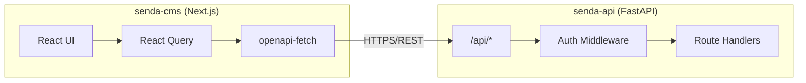
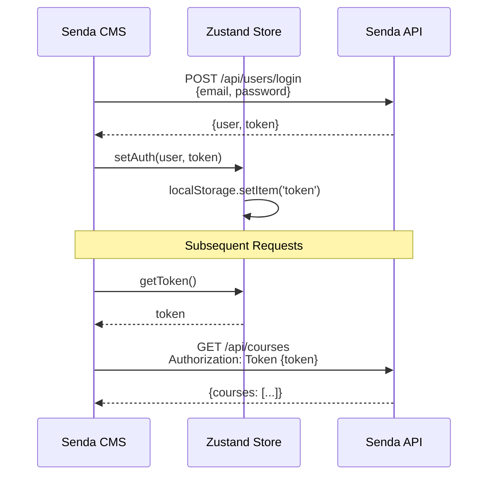
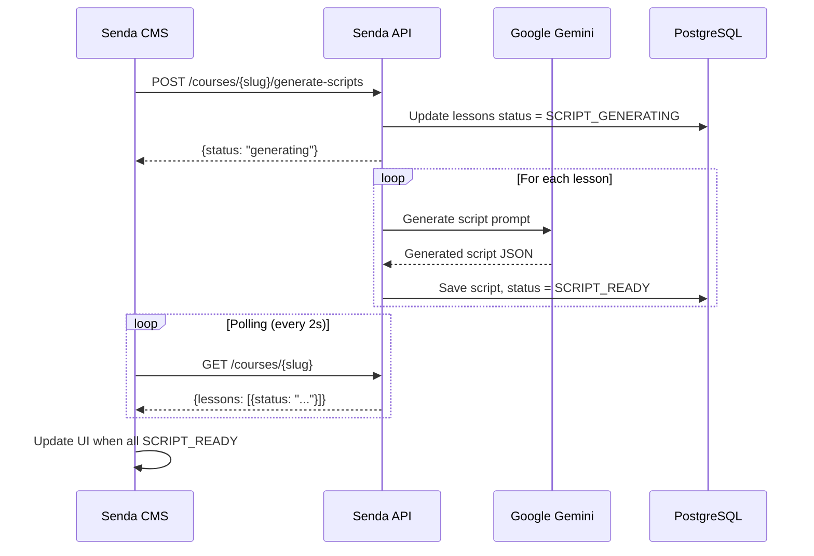
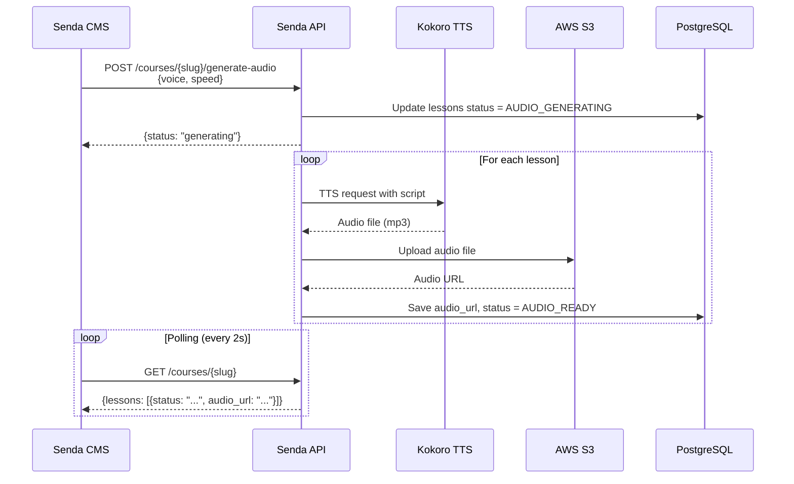

# Integration Architecture

**Project:** Senda
**Parts:** senda-api (Backend) ↔ senda-cms (Frontend)

---

## Communication Overview

The Senda platform consists of two main parts that communicate via REST API:



---

## API Contract

### Base Configuration

| Setting | Development | Production |
|---------|-------------|------------|
| Base URL | `http://localhost:8081/api` | `https://senda-api-xxx.run.app/api` |
| Protocol | HTTP | HTTPS |
| Authentication | JWT Bearer Token | JWT Bearer Token |
| Content-Type | application/json | application/json |

### OpenAPI Integration

The CMS uses **OpenAPI-first** development:

1. **API generates OpenAPI spec** at `/openapi.json`
2. **CMS generates TypeScript types** using `openapi-typescript`
3. **API calls use generated types** via `openapi-fetch` + `openapi-react-query`

```bash
# Generate types from running API
cd senda-cms
bun generate-types  # Points to http://localhost:8081/openapi.json
```

---

## Endpoint Overview

### Authentication

| Endpoint | Method | Description | Auth |
|----------|--------|-------------|------|
| `/api/users/login` | POST | User login, returns JWT | No |
| `/api/users` | POST | Register new user | No |

### User Profile

| Endpoint | Method | Description | Auth |
|----------|--------|-------------|------|
| `/api/user` | GET | Get current user | Yes |
| `/api/user` | PUT | Update current user | Yes |
| `/api/profiles/{username}` | GET | Get user profile | Yes |

### Courses

| Endpoint | Method | Description | Auth |
|----------|--------|-------------|------|
| `/api/courses` | GET | List all courses | Yes |
| `/api/courses` | POST | Create course | Yes |
| `/api/courses/{slug}` | GET | Get course by slug | Yes |
| `/api/courses/{slug}` | PUT | Update course | Yes |
| `/api/courses/{slug}` | DELETE | Delete course | Yes |
| `/api/courses/{slug}/generate-scripts` | POST | Generate all scripts | Yes |
| `/api/courses/{slug}/generate-audio` | POST | Generate all audio | Yes |

### Lessons

| Endpoint | Method | Description | Auth |
|----------|--------|-------------|------|
| `/api/courses/{slug}/lessons` | GET | List course lessons | Yes |
| `/api/courses/{slug}/lessons` | POST | Create lesson | Yes |
| `/api/courses/{slug}/lessons/{lesson_number}` | GET | Get lesson | Yes |
| `/api/courses/{slug}/lessons/{lesson_number}` | PUT | Update lesson | Yes |
| `/api/courses/{slug}/lessons/{lesson_number}` | DELETE | Delete lesson | Yes |
| `/api/courses/{slug}/lessons/reorder` | PUT | Reorder lessons | Yes |
| `/api/courses/{slug}/lessons/{lesson_number}/generate-script` | POST | Generate lesson script | Yes |
| `/api/courses/{slug}/lessons/{lesson_number}/generate-audio` | POST | Generate lesson audio | Yes |

### Tags

| Endpoint | Method | Description | Auth |
|----------|--------|-------------|------|
| `/api/tags` | GET | List all tags | Yes |

### Health Check

| Endpoint | Method | Description | Auth |
|----------|--------|-------------|------|
| `/api/health-check` | GET | Health check | No |

---

## Authentication Flow



### Token Storage

- **Location:** `localStorage` (via Zustand persist)
- **Format:** `Token <jwt_token>`
- **Header:** `Authorization: Token {token}`

---

## Data Flow: Script Generation



---

## Data Flow: Audio Generation



---

## Error Handling

### API Error Responses

```json
{
  "detail": "Error message describing what went wrong"
}
```

### Common HTTP Status Codes

| Code | Meaning | CMS Handling |
|------|---------|--------------|
| 200 | Success | Process response |
| 201 | Created | Process response |
| 400 | Bad Request | Show validation error |
| 401 | Unauthorized | Redirect to login |
| 403 | Forbidden | Show access denied |
| 404 | Not Found | Show not found |
| 422 | Validation Error | Show field errors |
| 500 | Server Error | Show generic error |

### CMS Error Handling Pattern

```typescript
// In mutation onError callback
onError: (error) => {
  toast.error(error.message || 'An error occurred');
}
```

---

## Shared Data Contracts

### Naming Conventions

| Layer | Convention | Example |
|-------|------------|---------|
| API Response | snake_case | `created_at`, `lesson_number` |
| TypeScript | camelCase (transformed) | `createdAt`, `lessonNumber` |
| API Params | snake_case | `?skip=0&limit=10` |
| Path Params | kebab-case | `/courses/{slug}/lessons` |

### Date Format

- **API:** ISO 8601 string (`2025-12-20T17:45:00Z`)
- **CMS Display:** Formatted with `date-fns`

---

## Environment Configuration

### CMS Environment Variables

```env
# API Connection
NEXT_PUBLIC_API_BASE_URL=http://localhost:8081/api

# Build Environment
NEXT_PUBLIC_BUILD=development

# JWT (must match API)
JWT_SECRET=your-jwt-secret
```

### API Environment Variables (relevant for CMS integration)

```env
# CORS
ALLOWED_ORIGINS=http://localhost:3000

# JWT
JWT_SECRET_KEY=your-jwt-secret
```

---

## Docker Network

When running via Docker Compose, services communicate on the `senda-network`:

```yaml
# Internal URLs
CMS → API: http://api:8000/api
API → Kokoro: http://kokoro_tts:8880/v1/audio/speech
API → PostgreSQL: postgres:5432
```

```yaml
# External URLs (host machine)
CMS: http://localhost:3000
API: http://localhost:8081
PostgreSQL: localhost:5439
Kokoro: http://localhost:8880
```
