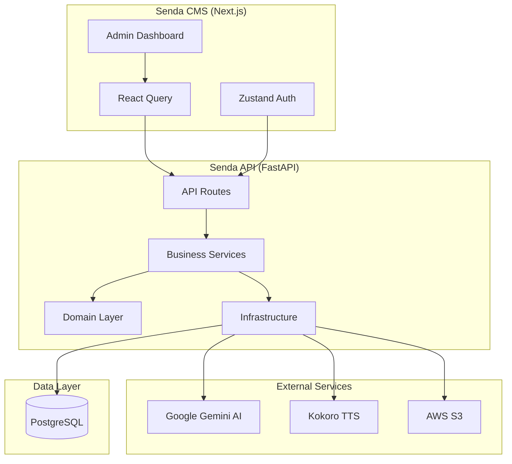
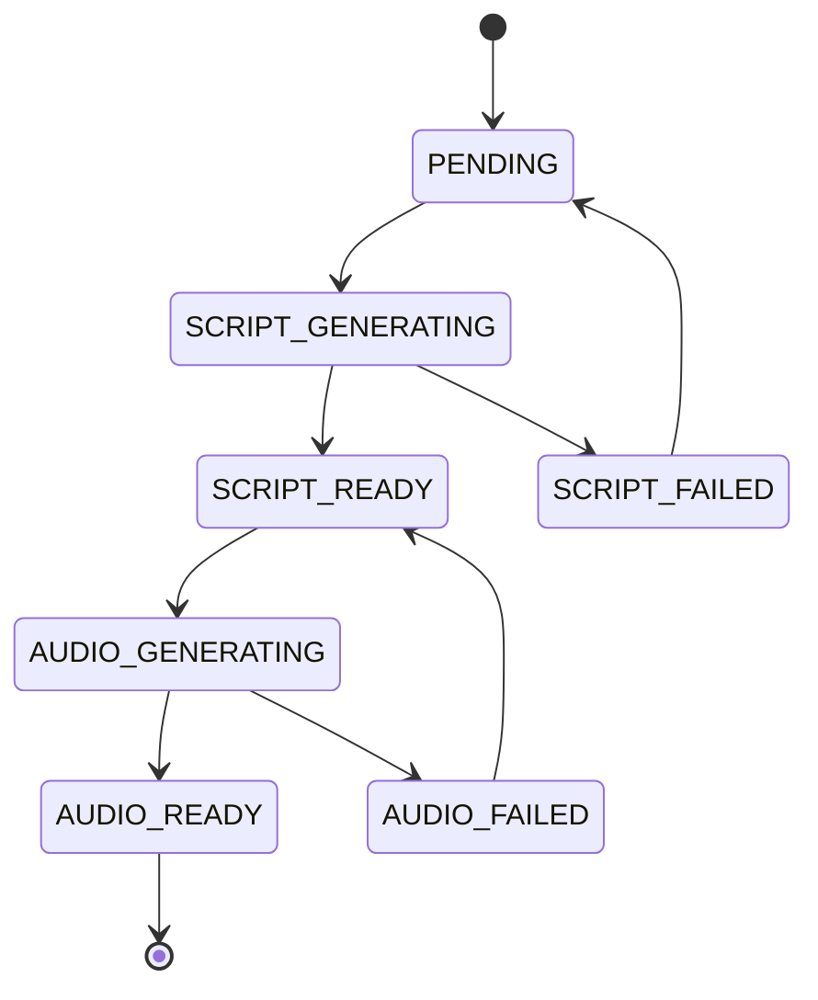

# Project Overview

**Project:** Senda
**Type:** AI-Powered Meditation Course Platform
**Repository Type:** Multi-Part (Backend + Frontend)

---

## Executive Summary

Senda is a complete platform for creating and managing guided meditation courses using AI. The system consists of:

1. **Senda API** - A Python FastAPI backend that handles:
   - Course and lesson CRUD operations
   - AI-powered script generation using Google Gemini
   - Audio synthesis using Kokoro TTS
   - User authentication and authorization
   - AWS S3 storage for generated audio files

2. **Senda CMS** - A Next.js admin dashboard that provides:
   - Intuitive course and lesson management interface
   - Real-time AI generation status tracking
   - Script editing and audio configuration
   - Admin authentication flows

---

## System Architecture



---

## Technology Summary

### Backend Stack

| Layer | Technology | Purpose |
|-------|------------|---------|
| API | FastAPI | REST API framework |
| ORM | SQLAlchemy 2.0 | Async database access |
| Migrations | Alembic | Database schema management |
| Validation | Pydantic | Request/response validation |
| Auth | PyJWT + bcrypt | JWT authentication |
| AI | Google Gemini | Script generation |
| TTS | Kokoro FastAPI | Audio synthesis |
| Storage | aioboto3 | AWS S3 file storage |
| Logging | structlog | Structured logging |

### Frontend Stack

| Layer | Technology | Purpose |
|-------|------------|---------|
| Framework | Next.js 16 | App Router + Server Components |
| Language | TypeScript 5 | Type safety |
| Styling | Tailwind CSS 4 | Utility-first CSS |
| Components | shadcn/ui | Accessible UI primitives |
| Server State | React Query 5 | API data caching |
| Client State | Zustand | Auth state management |
| Forms | React Hook Form + Zod | Form handling + validation |
| API Client | openapi-fetch | Type-safe API calls |

---

## Key Architectural Patterns

### Backend: Clean Architecture

```
senda/
├── api/           # Presentation Layer (Routes, Schemas)
├── core/          # Shared utilities (Config, Enums)
├── domain/        # Domain Layer (DTOs, Repository Interfaces)
├── infrastructure/# Data Layer (Models, Repositories, Providers)
└── services/      # Application Layer (Business Logic)
```

### Frontend: Container Pattern

```
src/
├── components/    # Reusable UI components
│   └── ui/       # shadcn/ui primitives
├── containers/   # Feature-specific containers
│   ├── Guest/    # Unauthenticated views
│   └── Main/     # Authenticated views
├── hooks/        # API hooks (React Query)
└── stores/       # Client state (Zustand)
```

---

## Domain Model

### Core Entities

| Entity | Description |
|--------|-------------|
| **User** | Admin users with authentication credentials |
| **Course** | Meditation course with metadata and lessons |
| **Lesson** | Individual lesson with script and audio |
| **Tag** | Categorization tags for courses |

### Lesson Status Flow



---

## Integration Points

| From | To | Protocol | Purpose |
|------|-----|----------|---------|
| CMS | API | REST/HTTPS | All CRUD operations |
| API | PostgreSQL | TCP | Data persistence |
| API | Gemini | HTTPS | Script generation |
| API | Kokoro | HTTP | Audio synthesis |
| API | S3 | HTTPS | Audio file storage |

---

## Deployment Architecture

### Production

- **API:** Google Cloud Run (auto-scaling)
- **CMS:** Vercel (edge deployment)
- **Database:** Cloud SQL for PostgreSQL (managed)
- **TTS:** Self-hosted Kokoro (GPU required)

### Development

- **Full Stack:** Docker Compose with all services
- **Individual:** Local development with hot reload

---

## Success Metrics

| Metric | Target |
|--------|--------|
| Page Load Time | < 2 seconds |
| API Response Time | < 1 second |
| System Uptime | > 99.9% |
| Script Generation Success | > 95% |
| Audio Generation Success | > 98% |

---

## Repository Structure

```
senda/
├── senda-api/          # Backend repository root
├── senda-cms/          # Frontend repository root
├── docker-compose.yml  # Full stack orchestration
├── Makefile           # Development commands
├── docs/              # Project-level documentation
└── _bmad-output/      # Generated AI documentation
```
